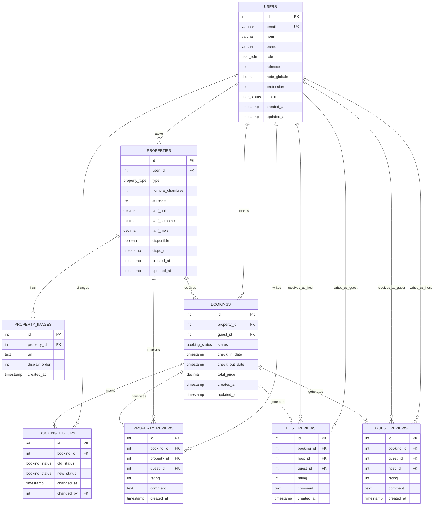

# Ibude - Schéma de Base de Données

```mermaid
erDiagram
    USERS {
        int id PK
        varchar email UK
        varchar nom
        varchar prenom
        user_role role
        text adresse
        decimal note_globale
        text profession
        user_status statut
        timestamp created_at
        timestamp updated_at
    }
    PROPERTIES {
        int id PK
        int user_id FK
        property_type type
        int nombre_chambres
        text adresse
        decimal tarif_nuit
        decimal tarif_semaine
        decimal tarif_mois
        boolean disponible
        timestamp dispo_until
        timestamp created_at
        timestamp updated_at
    }
    
    PROPERTY_IMAGES {
        int id PK
        int property_id FK
        text url
        int display_order
        timestamp created_at
    }
    
    BOOKINGS {
        int id PK
        int property_id FK
        int guest_id FK
        booking_status status
        timestamp check_in_date
        timestamp check_out_date
        decimal total_price
        timestamp created_at
        timestamp updated_at
    }
    
    BOOKING_HISTORY {
        int id PK
        int booking_id FK
        booking_status old_status
        booking_status new_status
        timestamp changed_at
        int changed_by FK
    }
    
    PROPERTY_REVIEWS {
        int id PK
        int booking_id FK
        int property_id FK
        int guest_id FK
        int rating
        text comment
        timestamp created_at
    }
    
    HOST_REVIEWS {
        int id PK
        int booking_id FK
        int host_id FK
        int guest_id FK
        int rating
        text comment
        timestamp created_at
    }
    
    GUEST_REVIEWS {
        int id PK
        int booking_id FK
        int guest_id FK
        int host_id FK
        int rating
        text comment
        timestamp created_at
    }
    
    %% Relations
    USERS ||--o{ PROPERTIES : "owns"
    PROPERTIES ||--o{ PROPERTY_IMAGES : "has"
    PROPERTIES ||--o{ BOOKINGS : "receives"
    USERS ||--o{ BOOKINGS : "makes"
    BOOKINGS ||--o{ BOOKING_HISTORY : "tracks"
    BOOKINGS ||--o| PROPERTY_REVIEWS : "generates"
    BOOKINGS ||--o| HOST_REVIEWS : "generates"
    BOOKINGS ||--o| GUEST_REVIEWS : "generates"
    PROPERTIES ||--o{ PROPERTY_REVIEWS : "receives"
    USERS ||--o{ PROPERTY_REVIEWS : "writes"
    USERS ||--o{ HOST_REVIEWS : "receives_as_host"
    USERS ||--o{ HOST_REVIEWS : "writes_as_guest"
    USERS ||--o{ GUEST_REVIEWS : "receives_as_guest"
    USERS ||--o{ GUEST_REVIEWS : "writes_as_host"
    USERS ||--o{ BOOKING_HISTORY : "changes"
```
__type nom_colonne contrainte "commentaire_optionnel"__